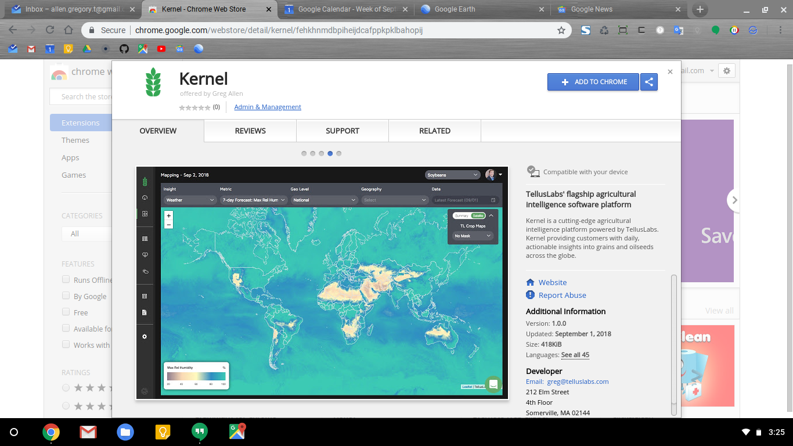
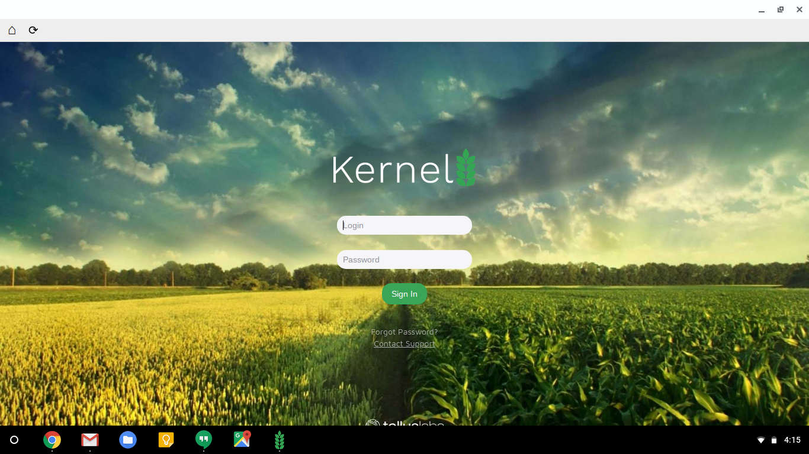

 > ### Update to Google's Support for Chrome Apps
 >
 > Since [Google's decision to retire Chrome apps for Windows, Mac, & Linux users](http://bit.ly/GCB-Retiring-Chrome-Apps), the Kernel Chrome App will now only be available to Chromebook users.  Subsequently, this project has transitioned towards a more passive management state.  In other words, we will continue to monitor this project for feature requests and bugs/errors, however the majority of our time will now be spent actively developing the [core Kernel web platform](http://bit.ly/Kernel-TL).
 >
 > To be clear: **The [Kernel web platform](http://bit.ly/Kernel-TL) will always be under active development, and we continue to release new features & stability improvements at our normal weekly cadence**.  All new features & improvements to the core Kernel web platform flow directly into the Kernel Chrome App as well, so no matter which version of Kernel you're using, you'll always have the latest & greatest product we have to offer.
 >
 > In summary:
 >
 > * You may continue to use the Kernel Chrome app on Chromebook devices for as long as you like
 >   * You may continue to use the core Kernel web platform on any device or operating system with a modern browser
 > * While the Kernel Chrome App will continue to function as normal, we will no longer be developing any new ***chromebook-specific*** features for the Kernel Chrome App
 >
 > We hope you'll continue to submit feature requests & bug reports, and we'll be watching this repository to make sure that we're available to respond to any questions.
 >
 > For all other inquiries, feel free to chat with us live using the in-product chat tool, or reach out to us by email via kernel-support@telluslabs.com.  As always, we'd love to hear from you!
 >
 > - [The Team at TellusLabs](http://bit.ly/TL-Company)

# The Kernel Chrome App

Kernel is now available as a native Chromebook app!  If you're using a Chromebook, you can now install & run Kernel as a native Chromebook app.  Install the Kernel Chrome App directly via the [Chrome Web Store](http://bit.ly/TL-Kernel-Chrome-App).

## How do I get Kernel Access?

Great question!  We're always offering free trial access to Kernel (no credit card required), and we'd love to bring you on board!  You can request your trial credentials by [filling out this form](http://bit.ly/TL-Request-Access) on our company homepage.

Once you submit the "Request Access" form, we have an automated process that generates your credentials and sets up your account.  However, there's typically a 4-5 hour delay between when you submit the form and when you receive the credentials email.  If you haven't received your credentials within 24 hours of submitting the Request Access form, please contact us at kernel-support@telluslabs.com and we'll get to the bottom of it.

 > The email containing your Kernel trail credentials comes from kernel-support@telluslabs.com, so make sure to add that email to your address book to avoid your credentials potentially getting caught in a spam filter!

### You're a tech company.  Why on earth does it take you 5 hours to send a credentials email?!

Another great question!  It takes us a few hours to send over your new trial credentials because we manually review each request to ensure we're providing the best trial experience possible.

Kernel is a highly configurable software platform containing a number of powerful features that are specific to certain customer types.  For example:

* The Kernel product for commodity traders contains a number of features specifically designed for commodity traders.
  * These features were designed specifically to help commodity traders tackle challenging aspects of their day-to-day work.  Subsequently, these features are only available for commodity trading customers.
* Likewise, the Kernel product for grain elevator operators contains a specific set of features designed to help grain elevators tackle the challenges specific to their work.
  * Subsequently, Kernel has a number of capabilities specifically designed for grain elevator customers that aren't available for commodity trading clients.

Once we get your form submission, we look up your company to get a sense for how Kernel can best help you, and we configure your Kernel trial to include the features that best fit your needs.

## Screenshots

Kernel Chrome Web Store Listing

Kernel Chrome App: Login

Kernel Chrome App: Dashboard

### Questions?

Please feel free to contact us kernel-support@telluslabs.com.
